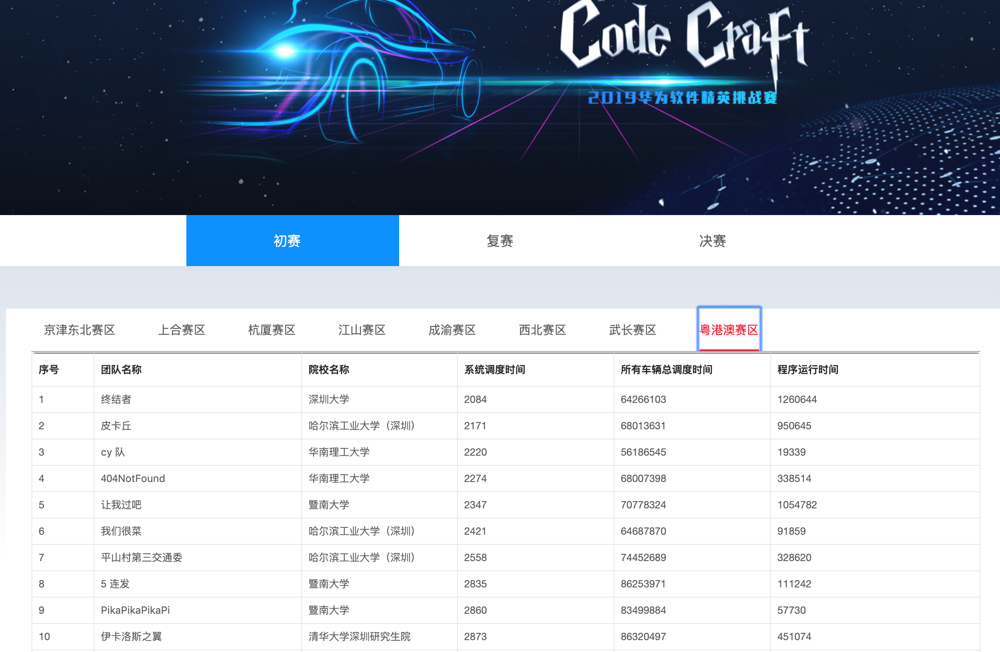
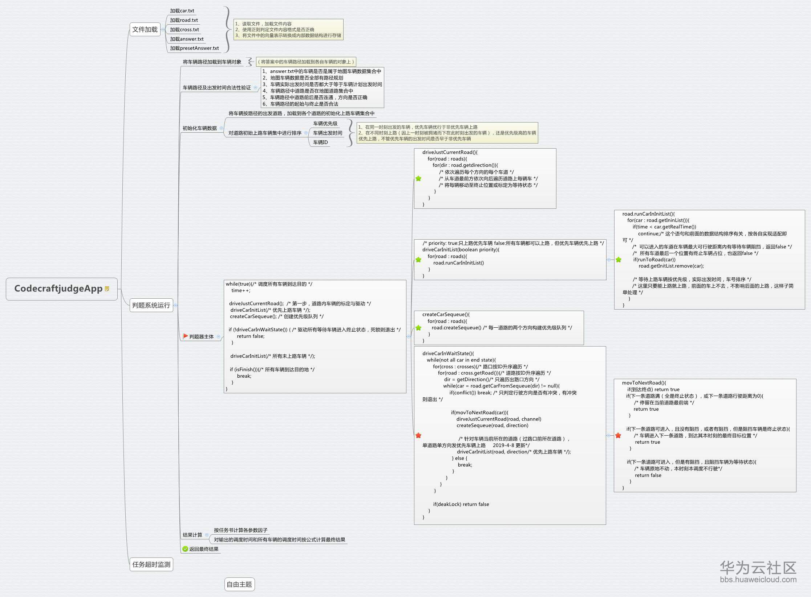
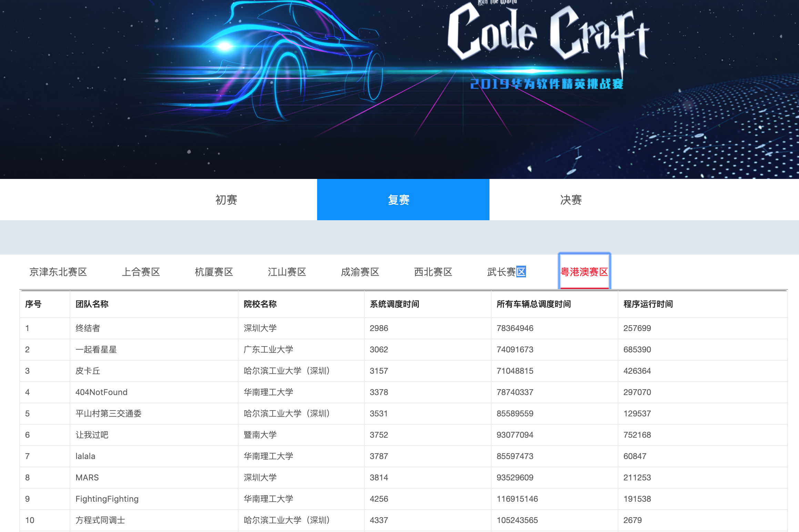

# 2019华为软件精英挑战赛
## 基本情况
- 大赛官网：https://codecraft.huawei.com/
- 全国八大赛区，共16310人报名参赛，本人在粤港澳赛区，最后顺利跻身全国32强
- 正赛名次：
    - 区域初赛：4（前32名可晋级区域复赛
    - 区域复赛：4（前4名可晋级全国总决赛
    - 全国总决赛：17～32（未晋级16强，具体名次未知
- 决赛时，全国32强齐聚深圳，除了现场对决，华为公司还安排了许多精彩的活动，我拍了很多视频剪了个[vlog](https://www.bilibili.com/video/av51150578)发在了b站，对这个比赛有兴趣的同学可以看看（别忘了顺手素质三连hhh

## 赛程设置
    1、线上初赛
    
    竞赛时间：3 月 8 日 - 3 月 29 日 正式报名
    
    3 月 15 日 - 3 月 29 日 初赛练习阶段
    
    3 月 30 日初赛比赛阶段
    
    竞赛规则：每赛区前 32 强队伍晋级复赛
    
    2、现场复赛
    
    竞赛时间：4 月 1 日 - 4 月 12 日 复赛练习阶段
    
    4 月 13 日 复赛比赛阶段
    
    竞赛地点：各区域现场复赛
    
    竞赛规则：每赛区前 4 强晋级总决赛
    
    3、总决赛
    
    竞赛时间：4 月 14 日 - 4 月 26 日 决赛练习阶段
    
    4 月 27 日决赛比赛阶段（深圳现场决赛）
    
    竞赛地点：深圳（华为公司总部）
    
    竞赛规则：现场分轮竞赛，决出全国八强、最优美代码奖
    
## 任务需求
- 在三轮训练赛时，都会给出任务书，在正赛时可能会有需求变更，需要快速解决问题
- 进入复赛训练赛后，出现了优先车辆与预置车辆
- 复赛正赛时，临时需求变更，可最多修改10%的预置车辆的预置路径（这个需求沿用到决赛训练赛与正赛
- 进入决赛训练赛后，加入了车牌识别的要求，需要用到华为云的Modelarts平台上部署在线服务，代码提交到官网后台后，自动调用识别模型的API接口判断识别准确率
- 决赛正赛时，临时需求变更2，可最多修改10%的预置车辆的预置路径或实际出发时间
- 具体可参考doc目录下各文件

## 初赛思路
- 训练赛车辆只有1w，路口数量140+与160+，因为只开放了四个训练地图，我们也只能推测正赛时也是差不多的规模

- 初赛的思路很简单，先用某种排序规则，为所有车排好序，然后按照均匀发车的思想，按照一定的发车速率确定所有车辆的实际出发时间

    排序规则试过很多种，最终确定优先发预计发车时间早的车，效果最好

- 依次用Dijkstra最短路径算法决定每辆车从起点到终点的路径

    Dijkstra算法需要事先知道每条路的权重（或者说cost值），这条路权重（cost值）更小，算法有更大的可能选择这条路，不难理解，道路越长，cost值越大，而道路车道数如果越多的话，更多的车辆可以被容纳，于是，我们使用的是比较简单的一个函数：weight=length/channel

- 这条路径确定后，为这条路径上的所有道路进行"惩罚"，也就是加大它们的cost值，这会使得Dijkstra算法下次寻找最短路径时有较大可能"绕过"这些被"惩罚"的道路

    惩罚因子也是一个可调参数，地图不同，

- 以此类推，直至所有车辆的路径确定

- 简而言之，这种解法没有考虑到破除死锁的问题，当发生死锁时，增加发车速率，在当前地图最大发车速率附近调整排序规则、权重函数、惩罚因子，最后在有限的正赛时间里提交最好的答案

- 大佬开源的[可视化调度器](https://github.com/AkatsukiCC/huawei2019-with-visualization)帮了我们大忙，非常感谢

- 初赛排名粤港澳赛区第四名

    

## 复赛思路
- 因为加入优先车辆，发车规则与路口调度规则都有变化，根据[大赛官方论坛](https://bbs.huaweicloud.com/forum/forum-762-1.html)里置顶的帖子中的官方判题器的逻辑（如下），花了一个星期终于把判题器撸出来了！
    
    

- 判题器非常复杂，而且调度规则特别多坑，后面好几天都在找bug，而且赛题组的判题器逻辑刚开始没有给的特别清楚，导致参赛选手产生了歧义，不过编写判题器的这个星期，我感觉到我的代码能力、发现问题能力、debug能力都得到了极大的提升！这个星期应该是整个比赛成长最快的一个星期！

- 继续回到复赛解题思路，预置车辆的发车时间与预置路径是已经确定好的（正赛时才接到了"可最多修改10%预置车辆的预置路径"的需求变更），根据大佬开源的可视化调度器，发现预置车辆的路径并不是填满整个地图的，也就是说预置车辆是我们当前解法的瓶颈，很多时候死锁就发生在前期

- 首先通过打日志（logging）大致确定每辆车在地图中要跑多久的平均数（大约是100），然后在最后一辆预置车的出发时间后加上100，作为分界时间线，分界线之前的发车速率较低(departure_rate)，分界线之后的发车速率较高（acc_departure_rate)

- 上学期学了随机信号处理，想到了利用自回归（Auto Regressive）模型更为精准地模拟道路的权重变化，当前道路的权重仅取决于前N个时间片的"惩罚"，在确定所有车辆的路径时维持一个长度为N的队列，每次惩罚时，把惩罚信息加入到队尾，然后从队头拿到之前第N个惩罚的信息，"释放"这个惩罚

    为何会想到这个呢？
   
   之前解题思路中的惩罚，是持久的，也就是说：一辆车从起点出发，大约平均100个时间片到达了终点，这条路径的惩罚信息一直存在！
   
   不难理解，在决定最后一辆车的路径时，第一辆车早就跑完了，所以它造成的惩罚应该是无效的，应该及时释放
   
   最后确定队列长度N为100，这里用到了双端队列([deque](https://docs.python.org/zh-cn/3/library/collections.html#collections.deque))的数据结构

- 考虑死锁产生的条件，路口的第一优先级车辆相互等待，于是产生死锁，那么在决定某辆车的最短路径时，如果路口其他方向的车较少，那么该车就有较小概率死锁，按照这一思想，在确定最短路径后，不仅对最短路径的沿途进行惩罚，也对沿途路口的进入道路也进行惩罚，但是惩罚因子减半

- 后来还想到了一些小优化，比如最后几百辆车加速发车（因为最后地图很通畅了），但这些都是小缝小补了

- 复赛正赛时的需求变更，其实对我们来说没什么影响，因为车辆总数是6w，预置车辆3000+，只能修改10%，那也就是300+，那如何选择这300+多辆呢？现场只有三小时调试代码的时间，试了好几种方法，比如"根据预置车辆出发时间从低到高排序，修改前10%"，但效果都比不修改要差，于是正赛时就按照前文说的方法，最后成功拿到了通往全国总决赛的最后一张入场券

    

## 决赛思路
- 前几天都在尝试找到一种修改预置车辆的路径使得成绩变好的方法，可惜没有结果

- 于是把精力放在神经网络的训练上，官方给了4000张车牌图片，3200做训练集，800做验证集

- 因为队伍三人都没有这方面的经验，所以首先试了试开源的卷积网络模型，顺带一提，华为云上的Modelarts平台学习成本挺高的，花了好久才学会完整的流程

- 识别准确率刚开始惨不忍睹，于是请教了做OCR的大佬，通过数据增强和pytorch和一些手法，最后准确率达到了99%

- 最后考虑看能否破死锁，因为此时距离出发前往深圳只剩几天，动态规划破死锁显然不够时间，可以试试半静态半动态的车辆调度规划

- 首先尝试：发生死锁的第一优先车推迟到死锁时刻发车，初始化全地图，但注意到这些第一优先级的车辆可能都是预置车辆，所以用这种死锁回溯的方法要动态修改预置车辆的路径，还得判断是否超过10%，总之不太行

- 然后尝试：发生死锁的第一优先车不推迟发车时间，但是修改它们的路径为最短路径（不考虑路况），这样会添加一些随机性，有较大概率绕开之前死锁的路口，程序会一直循环下去，不能保证在有限时间内能得到满意的解

- 尝试了很久，在我们这种半静态半动态规划的环境下，尝试解决死锁的问题很难的，我们的（伪）动态惩罚是提前规划好的，所以在产生死锁时重新规划路径是不均匀的
新想法：产生死锁时，不在调度器内延迟发车or重新规划路径，而是回到发车速率上，也就是说：发生死锁时，增大发车速率，重新规划所有车辆的路径

- 由于决赛正赛的32进16开放地图，且有三小时调试代码机会，所以我们的目标就是在这三小时调参到最优，因为上传的代码不能修改，直接跑16进8的地图，所以我们的目标就是在16进8时有成绩（不死锁）。
继续调整发车速率，由于只能跑15min，而我们的计算与调度都比较慢，所以最多只能跑4次。如果前三次都为死锁，那么第四次会给出一个非常差的解（departure_rate=20,acc_departure_rate=25），但是99.99%是有成绩的（如果地图不变更的话）

        现场对决前一晚决定不冒风险，减少为三次尝试，这样肯定是有解的

- 很遗憾，决赛没有更进一步，最后名次应该在20名开外（进入总决赛的共32支队伍）

- 决赛训练赛最后阶段的启发：框架不够好，后期很难扩展，很难实现新想法，万事开头难，不要想着刚开始就去走捷径，那样难题就全留在了后面

## 感想
- 比赛历时50多天，花了很多很多的时间、很多很多的精力在比赛上面，能挺进决赛我也已满足，毕竟拿到了手机，而且在深圳的吃喝住行华为全包了

- 撸了很多代码，de了很多bug，能力蹭蹭蹭地往上涨，发现问题、解决问题的能力提高

- 无论从赛程设置、决赛安排、工作人员的负责程度上来讲，华为都无可挑剔，给工作人员点赞

